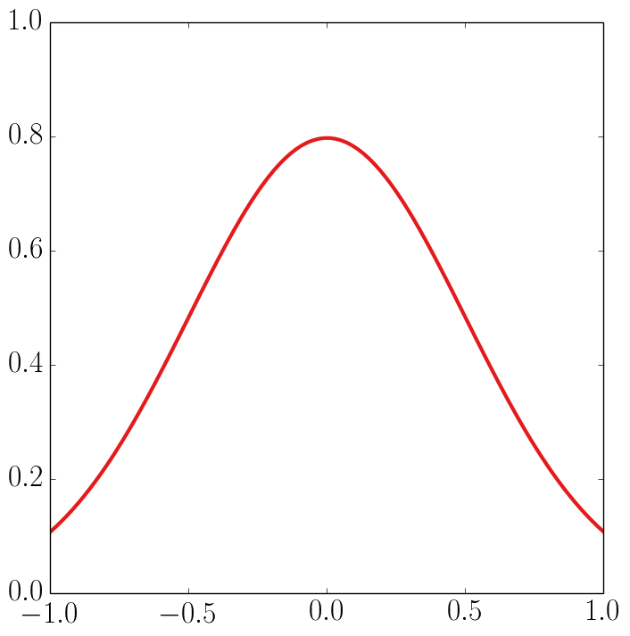

# palette

`palette` is a tiny library for choosing balanced, high-contrast colors for Python plots that are also distinguishable by people with most major forms of colorblindness.

### Usage

`palette` exports two functions, `configure()`, which sets various plot properties to nice defaults, and `pc()`, which returns a color name. If `pc()` is called with no arguments, it will cycle through eight different colors:

```Python
import palette
from palette import pc

palette.configure(True) # Change to False to turn off LaTeX compilation.

plt.plot(x1, y1, pc())
plt.plot(x2, y2, pc())
plt.plot(x3, y3, pc())
plt.plot(x4, y4, pc())
plt.plot(x5, y5, pc())
plt.plot(x6, y6, pc())
plt.plot(x7, y7, pc())
plt.plot(x8, y8, pc())
```


If you supply a color name (`black`, `red`, `blue`, `green`, `orange`, `purple`, `brown`, or `gray`) it will return that color.

```Python
plt.plot(x1, y1, pc("red"))
```



Abbreivations for these colors will also work: (`k`, `r`, `b`, `g`, `o`, `p`, `n`, or `a`).

If you supply both a color name and a float between 0 and 1, it will return a gradation of that color with 0 being the darkest and 1 being the lightest.

```Python
for a in np.linspace(0, 1, 10):
    plt.plot(x1, f(x1, a), pc("r", a))
```


A value of 0.5 will always return the default gradation of that color.
